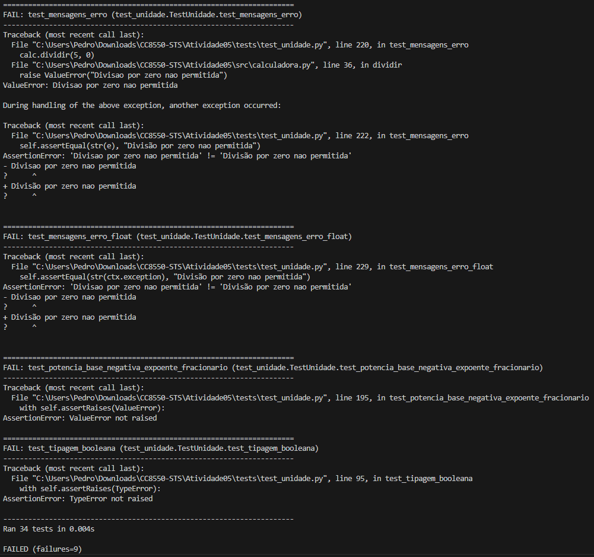

## 1) Resultado da execução dos testes
- **Total**: 34  
- **Aprovados**: 25  
- **Falhas**: 9

### 2) Cobertura de código obtida

Para verificação da cobertura de cada teste abra
<a href="./htmlcov/index.html" target="_blank" rel="noopener">index.html</a>. em seu navegador.

### 3) Problemas encontrados

1. **test_operacoes_sequenciais_incorretas**  
   Esperado `15`, obtido `16.0` → ordem/estado das operações não segue a regra especificada.  
   **Correção:** garantir que cada operação atualize `self._ultimo_resultado` antes do próximo passo e que a sequência use sempre o resultado anterior (sem reusar operandos antigos).

2. **test_entrada_saida_multiplicacao_incorreta**  
   Esperado último resultado `16`, obtido `15` → atualização de estado/uso de operandos incorreto após multiplicação.  
   **Correção:** corrigir a operação de multiplicação para escrever em `self._ultimo_resultado` e registrar no histórico antes de qualquer leitura subsequente.

3. **test_formatacao_decimal_no_historico**  
   Esperado `"0.1 + 0.2 = 0.3"`, obtido `"0.1 + 0.2 = 0.30000000000000004"` → falta normalização de ponto flutuante ao registrar histórico.  
   **Correção:** padronizar formatação ao salvar no histórico (ex : `f"{valor:.1f}"`) para produzir `0.3`.

4. **test_historico_nao_deve_poder_ser_mutado_externamente**  
   Tamanho do histórico mudou após tentativa externa → fuga por referência; interface não imutável.  
   **Correção:** tornar interno `self._historico` e expor via propriedade somente-leitura que retorna `tuple(self._historico)` (ou cópia).

5. **test_inicializacao_instancias_independentes**  
   `len(b.historico) == 0` (esperado `1`) → histórico compartilhado/atributo de classe ou não inicializado por instância.  
   **Correção:** inicializar `self._historico = []` dentro de `__init__` e remover qualquer default mutável em nível de classe.

6. **test_mensagens_erro**  
   Mensagem divergente: **obtido** `"Divisao por zero nao permitida"` vs **esperado** `"Divisão por zero nao permitida"` → padronizar acento.  
   **Correção:** lançar exatamente `ValueError("Divisão por zero nao permitida")`.

7. **test_mensagens_erro_float**  
   Mesmo problema de acentuação acima.  
   **Correção:** reutilizar a mesma constante de mensagem com acentuação correta em todos os locais.

8. **test_potencia_base_negativa_expoente_fracionario**  
   `ValueError` não lançado → aceitar apenas expoente inteiro para base negativa.  
   **Correção:** antes de calcular, se `base < 0` e `not float(expoente).is_integer()`: `raise ValueError(<mensagem esperada>)`.

9. **test_tipagem_booleana**  
   `TypeError` não lançado para `bool` → tratar `bool` explicitamente (subclasse de `int` em Python).  
   **Correção:** no validador de entrada, rejeitar `bool`: `if isinstance(x, bool) or isinstance(y, bool): raise TypeError(<mensagem>)`.

---

## 3) Lições aprendidas — por tipo de teste (versão enxuta)

### 3.1 Testes de Unidade
- **Enxergam o detalhe:** garantem contratos de cada método (entradas, saídas, efeitos colaterais, mensagens).

### 3.2 Testes de Integração
- **Enxergam o fluxo:** conferem a colaboração entre métodos e a atualização correta do estado.

### 3.3 Testes de Limite / Particionamento de Equivalência
- **Enxergam as bordas:** validam comportamento em extremos e classes de entrada.

### 3.4 Testes de Robustez
- **Enxergam falhas controladas:** verificam tipo e texto das exceções.

### 3.5 Testes de Estado
- **Enxergam encapsulamento:** garantem que coleções internas não vazem e que instâncias não compartilhem estado.

### 3.6 Testes de Precisão Numérica 
- **Enxergam estabilidade numérica:** asseguram que resultados exibidos sejam normalizados/formatados de forma correta.

### 3.7 Testes de Mensagens 
- **Enxergam comunicação:** confirmam clareza e consistência de textos apresentados ao usuário da API.
